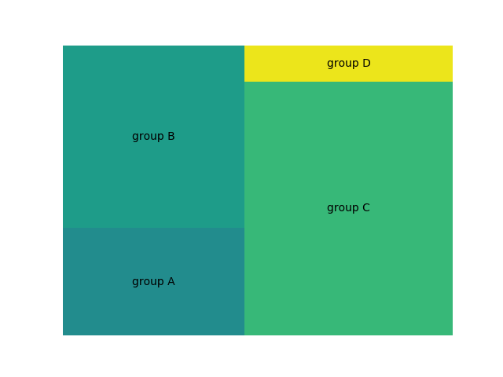
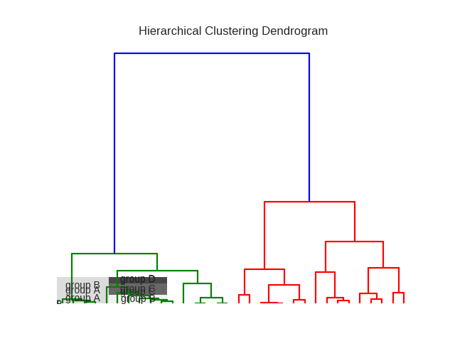
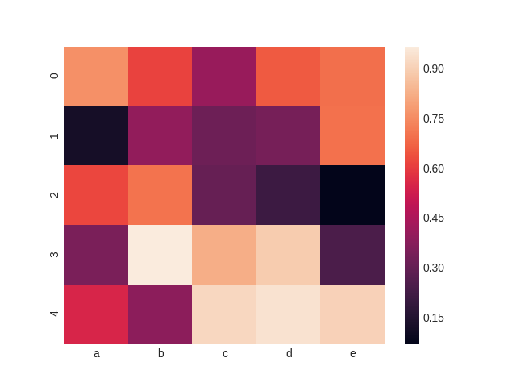
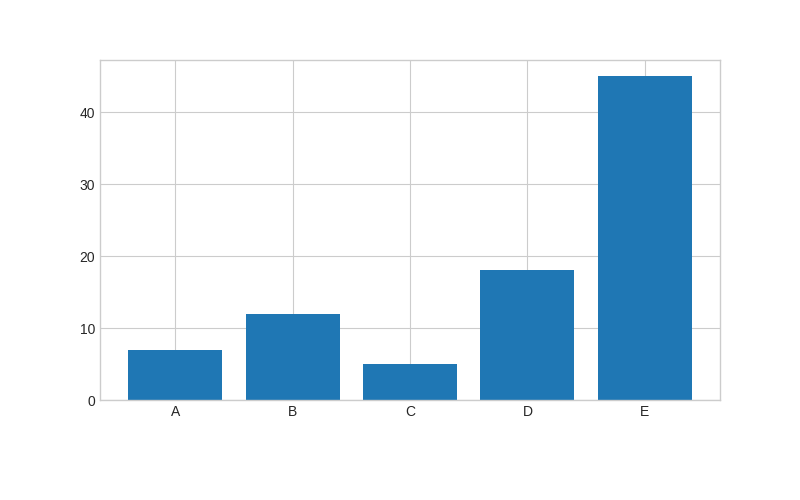

Visualization
=============

<http://achariam.com/dataviz/>

1.  Good data visualization is informative

Well presented data forms the backbone of a compelling story. It has the
power to strengthen and illuminate a narrative—improving understanding
and focusing on what’s important.

1.  Good data visualization is well balanced

Communicating quantitative data effectively requires the right balance
of components. Color is used with purpose and is not distracting. All
parts are labeled and include a legend when necessary. The scale of the
visualization must be immediately identifiable. The standard lexicon of
graphs are often all that is required—do not use pie charts.

1.  Good data visualization is equally concerned with what is not
    displayed

People are easily overwhelmed with extraneous details. Simplify and
reduce what is being presented to what is essential.

1.  Good data visualization is created with pure data

Avoid utilizing muddy or incomplete sources of data. Misleading the
audience with false information or lack of clarity is in poor taste.
Ultimately, good data visualization enables better decisions and
actions.

1.  Good data visualization is human

Parsing large data quantities of data is beyond human perception. The
goal with any kind of data visualization is to augment and improve human
perception. Just like a microscope it allows us to explore data within
the realm of our understanding.

Data exploration in R
---------------------

``` {.bash}
binisearch.py -o 'Data exploration in R'
```

Hist, boxplot etc

Univariate bivariate and multivariate visualization
---------------------------------------------------

``` {.bash}
binisearch.py -o 'Univariate bivariate and multivariate visualization'
```

ggplot2
-------

``` {.bash}
binisearch.py -o 'ggplot2'
```

Common code
-----------

``` {.python .rundoc-block rundoc-language="python" rundoc-session="yes"}
def display_inline(filename, plt):
    plt.savefig(filename)
    print()
    print('[[{}]]'.format(filename))
    plt.clf()
    plt.cla()

```

Histogram and Pie(Uni)
----------------------

``` {.bash}
binisearch.py -o 'Histogram and Pie(Uni)'
```

``` {.python .rundoc-block rundoc-language="python" rundoc-results="output" rundoc-exports="both"}
# alpha is opacity

import numpy as np
#import matplotlib.mlab as mlab
import matplotlib.pyplot as plt

x = [21,22,23,4,5,6,77,8,9,10,31,32,33,34,35,36,37,18,49,50,100]
num_bins = 5
n, bins, patches = plt.hist(x, num_bins, facecolor='blue', alpha=0.4)
#plt.show()

def display_inline(filename, plt):
    plt.savefig(filename)
    print()
    print('[[{}]]'.format(filename))


display_inline('./images/histogram.png', plt)

```


```

Tree and Treemap
----------------

``` {.bash}
binisearch.py -o 'Tree and Treemap'
```

<https://python-graph-gallery.com/200-basic-treemap-with-python/>

``` {.python .rundoc-block rundoc-language="python" rundoc-results="output" rundoc-exports="both"}

# libraries 
import matplotlib.pyplot as plt 
import squarify # pip install squarify (algorithm for treemap) 


def display_inline(filename, plt):
    plt.savefig(filename)
    print()
    print('[[{}]]'.format(filename))
    plt.clf()
    plt.cla()


# If you have 2 lists 
squarify.plot(sizes=[13,22,35,5], label=["group A", "group B", "group C", "group D"]) 
plt.axis('off') 
display_inline('./images/treemap1.png', plt)

# If you have a data frame? 
import pandas as pd 
df = pd.DataFrame({'nb_people':[8,3,4,2], 'group':["group P", "group Q", "group R", "group S"] }) 
squarify.plot(sizes=df['nb_people'], label=df['group']) 
plt.axis('off') 
display_inline('./images/treemap2.png', plt)


```



```

Dendrogram
----------

<https://python-graph-gallery.com/400-basic-dendrogram/>

``` {.python .rundoc-block rundoc-language="python" rundoc-session="yes" rundoc-results="output" rundoc-exports="both"}

# Libraries
import pandas as pd
from matplotlib import pyplot as plt
from scipy.cluster.hierarchy import dendrogram, linkage
import numpy as np

# Import the mtcars dataset from the web + keep only numeric variables
url = 'https://python-graph-gallery.com/wp-content/uploads/mtcars.csv'
df = pd.read_csv(url)
df = df.set_index('model')
del df.index.name
df


# Calculate the distance between each sample
# You have to think about the metric you use (how to measure similarity) + about the method of clusterization you use (How to group cars)
Z = linkage(df, 'ward')


# Make the dendrogram
plt.title('Hierarchical Clustering Dendrogram')
plt.xlabel('sample index')
plt.ylabel('distance (Ward)')
dendrogram(Z, labels=df.index, leaf_rotation=90)

#plt.show()
display_inline('./images/dendrogram.png', plt)

```


```

Scatterplot(bi)
---------------

``` {.bash}
binisearch.py -o 'Scatterplot(bi)'
```

``` {.python .rundoc-block rundoc-language="python" rundoc-session="yes" rundoc-results="output" rundoc-exports="both"}
import matplotlib.pyplot as plt
plt.style.use('seaborn-whitegrid')
import numpy as np

x = np.linspace(0, 10, 30)
y = np.sin(x)

plt.plot(x, y, 'o', color='black');
display_inline('./images/scatterplot1.png', plt)
```


```

``` {.python .rundoc-block rundoc-language="python" rundoc-session="yes" rundoc-results="output" rundoc-exports="both"}
import matplotlib.pyplot as plt
plt.style.use('seaborn-whitegrid')
import numpy as np

x = np.linspace(0, 10, 30)
y = np.sin(x)

plt.scatter(x, y, marker='o', color='black');
display_inline('./images/scatterplot2.png', plt)
```


```

Heatmap
-------

<https://python-graph-gallery.com/heatmap/>

``` {.python .rundoc-block rundoc-language="python" rundoc-session="yes" rundoc-results="output" rundoc-exports="both"}
import seaborn as sns
import pandas as pd
import numpy as np

# Create a dataset (fake)
df = pd.DataFrame(np.random.random((5,5)), columns=["a","b","c","d","e"])

# Default heatmap: just a visualization of this square matrix
p1 = sns.heatmap(df)
display_inline('./images/heatmap.png', plt)
```


```

Line charts(bi)
---------------

``` {.bash}
binisearch.py -o 'Line charts(bi)'
```

``` {.python .rundoc-block rundoc-language="python" rundoc-session="yes" rundoc-results="output" rundoc-exports="both"}
import matplotlib.pyplot as plt
plt.style.use('seaborn-whitegrid')
import numpy as np

x = np.linspace(0, 10, 30)
y = np.sin(x)

plt.plot(x, y, color='black');
#plt.show()
display_inline('./images/line_charts.png', plt)

```


```

Spatial charts
--------------

``` {.bash}
binisearch.py -o 'Spatial charts'
```

Survey plot
-----------

A survey plot is a simple multi-attribute visualization technique that
can help to spot correlations between any two variables especially when
the data is sorted according to a particular dimension. Each horizontal
splice in a plot corresponds to a particular data instance. The data on
a specific attribute is shown in a single column, where the length of
the line corresponds to the dimensional value. When data includes a
discrete or continuous class, the slices (data instances) are colored
correspondingly.

Implementation in Orange supports sorting by two selected attributes
(Sorting). The attributes shown in the plot are listed in Shown
attributes box, all other appear in the list of Hidden attributes.

Below is a snapshot of survey plot widget for an Iris. Plot nicely shows
that petal width and length and sepal length are correlated. It is also
very clear that Iris-setosa can be classified based on petal length or
width alone, while for the Iris versicolor and virginica there is some
ambiguity with some potential outliers, one of which is highlighted in
the snapshot.

<https://docs.orange.biolab.si/2/widgets/rst/visualize/surveyplot.html>

``` {.bash}
binisearch.py -o 'Survey plot visualization'
```

Timeline
--------

``` {.bash}
binisearch.py -o 'Timeline'
```

<https://matplotlib.org/gallery/lines_bars_and_markers/timeline.html>

``` {.python .rundoc-block rundoc-language="python" rundoc-results="output" rundoc-tangle="yes" rundoc-tangle="/tmp/timeline.py" rundoc-exports="both"}
import matplotlib.pyplot as plt
import numpy as np
import matplotlib.dates as mdates
from datetime import datetime

# A list of Matplotlib releases and their dates
# Taken from https://api.github.com/repos/matplotlib/matplotlib/releases
names = ['v2.2.2', 'v2.2.1', 'v2.2.0', 'v2.1.2', 'v2.1.1', 'v2.1.0', 'v2.0.2',
         'v2.0.1', 'v2.0.0', 'v1.5.3', 'v1.5.2', 'v1.5.1', 'v1.5.0', 'v1.4.3',
         'v1.4.2', 'v1.4.1', 'v1.4.0']

dates = ['2018-03-17T03:00:07Z', '2018-03-16T22:06:39Z',
         '2018-03-06T12:53:32Z', '2018-01-18T04:56:47Z',
         '2017-12-10T04:47:38Z', '2017-10-07T22:35:12Z',
         '2017-05-10T02:11:15Z', '2017-05-02T01:59:49Z',
         '2017-01-17T02:59:36Z', '2016-09-09T03:00:52Z',
         '2016-07-03T15:52:01Z', '2016-01-10T22:38:50Z',
         '2015-10-29T21:40:23Z', '2015-02-16T04:22:54Z',
         '2014-10-26T03:24:13Z', '2014-10-18T18:56:23Z',
         '2014-08-26T21:06:04Z']
dates = [datetime.strptime(ii, "%Y-%m-%dT%H:%M:%SZ") for ii in dates]

levels = np.array([-5, 5, -3, 3, -1, 1])
fig, ax = plt.subplots(figsize=(8, 5))

# Create the base line
start = min(dates)
stop = max(dates)
ax.plot((start, stop), (0, 0), 'k', alpha=.5)

# Iterate through releases annotating each one
for ii, (iname, idate) in enumerate(zip(names, dates)):
    level = levels[ii % 6]
    vert = 'top' if level < 0 else 'bottom'

    ax.scatter(idate, 0, s=100, facecolor='w', edgecolor='k', zorder=9999)
    # Plot a line up to the text
    ax.plot((idate, idate), (0, level), c='r', alpha=.7)
    # Give the text a faint background and align it properly
    ax.text(idate, level, iname,
            horizontalalignment='right', verticalalignment=vert, fontsize=14,
            backgroundcolor=(1., 1., 1., .3))

ax.set(title="Matplotlib release dates")
# Set the xticks formatting
# format xaxis with 3 month intervals
ax.get_xaxis().set_major_locator(mdates.MonthLocator(interval=3))
ax.get_xaxis().set_major_formatter(mdates.DateFormatter("%b %Y"))
fig.autofmt_xdate()

# Remove components for a cleaner look
plt.setp((ax.get_yticklabels() + ax.get_yticklines() +
          list(ax.spines.values())), visible=False)
#plt.show()
def display_inline(filename):
    plt.savefig(filename)
    print()
    print('[[{}]]'.format(filename))

display_inline('./images/timeline.png')

```


```

Barplot
-------

<https://python-graph-gallery.com/barplot/>
<https://python-graph-gallery.com/1-basic-barplot/>

``` {.python .rundoc-block rundoc-language="python" rundoc-session="yes" rundoc-results="output" rundoc-exports="both"}
import numpy as np
import matplotlib.pyplot as plt

# Make a fake dataset:
height = [7, 12, 5, 18, 45]
bars = ('A', 'B', 'C', 'D', 'E')
y_pos = np.arange(len(bars))

# Create bars
plt.bar(y_pos, height)

# Create names on the x-axis
plt.xticks(y_pos, bars)

# Show graphic
#plt.show()
display_inline('./images/barplot.png', plt)

```


```

Violinplot
----------

<https://python-graph-gallery.com/violin-plot/>
<https://python-graph-gallery.com/58-show-number-of-observation-on-violinplot/>

``` {.python .rundoc-block rundoc-language="python" rundoc-results="output" rundoc-exports="both"}

# library & dataset
import matplotlib.pyplot as plt
import seaborn as sns, numpy as np
df = sns.load_dataset("iris")

# Basic violinplot
ax = sns.violinplot(x="species", y="sepal_length", data=df)

# Calculate number of obs per group & median to position labels
medians = df.groupby(['species'])['sepal_length'].median().values
nobs = df['species'].value_counts().values
nobs = [str(x) for x in nobs.tolist()]
nobs = ["n: " + i for i in nobs]

# Add it to the plot
pos = range(len(nobs))
for tick,label in zip(pos,ax.get_xticklabels()):
    ax.text(pos[tick], medians[tick] + 0.03, nobs[tick], horizontalalignment='center', size='x-small', color='w', weight='semibold')
#plt.show()

def display_inline(filename):
    plt.savefig(filename)
    print()
    print('[[{}]]'.format(filename))
display_inline('./images/violinplot.png')

```


```

pairplot
--------

<https://seaborn.pydata.org/generated/seaborn.pairplot.html>

``` {.python .rundoc-block rundoc-language="python" rundoc-results="output" rundoc-exports="both"}
import matplotlib.pyplot as plt
import seaborn as sns; sns.set(style="ticks", color_codes=True)
iris = sns.load_dataset("iris")
g = sns.pairplot(iris)
#plt.show()

def display_inline(filename):
    plt.savefig(filename)
    print()
    print('[[{}]]'.format(filename))

display_inline('./images/pairplot.png')

```


```

lmplot
------

<https://seaborn.pydata.org/generated/seaborn.lmplot.html>

``` {.python .rundoc-block rundoc-language="python" rundoc-results="output" rundoc-exports="both"}
import matplotlib.pyplot as plt
import seaborn as sns; sns.set(color_codes=True)
tips = sns.load_dataset("tips")
g = sns.lmplot(x="total_bill", y="tip", data=tips)
filename = 'lmplot.png'
#plt.show()
def display_inline(filename):
    plt.savefig(filename)
    print()
    print('[[{}]]'.format(filename))
display_inline('./images/lmplot.png')

```


```

joinplot
--------

<https://seaborn.pydata.org/generated/seaborn.jointplot.html>

``` {.python .rundoc-block rundoc-language="python" rundoc-results="output" rundoc-exports="both"}
import matplotlib.pyplot as plt
import seaborn as sns; sns.set(style="white", color_codes=True)
tips = sns.load_dataset("tips")
g = sns.jointplot(x="total_bill", y="tip", data=tips)
def display_inline(filename):
    plt.savefig(filename)
    print()
    print('[[{}]]'.format(filename))

display_inline('./images/joinplot.png')
```


```

Distributions
-------------

<https://seaborn.pydata.org/tutorial/distributions.html>

Contour
-------

<https://www.python-course.eu/matplotlib_contour_plot.php>

``` {.python .rundoc-block rundoc-language="python" rundoc-results="output" rundoc-exports="both"}
import matplotlib.pyplot as plt
import numpy as np

xlist = np.linspace(-3.0, 3.0, 3)
ylist = np.linspace(-3.0, 3.0, 4)
X, Y = np.meshgrid(xlist, ylist)
Z = np.sqrt(X*2 + Y**2)
print(X)
plt.figure()
cp = plt.contour(X, Y, Z)
plt.clabel(cp, inline=True, 
          fontsize=10)
plt.title('Contour Plot')
plt.xlabel('x (cm)')
plt.ylabel('y (cm)')
#plt.show()
def display_inline(filename):
    plt.savefig(filename)
    print()
    print('[[{}]]'.format(filename))

display_inline('./images/contour.png')

```


```

What is mesh grid?
------------------

``` {.python .rundoc-block rundoc-language="python" rundoc-results="output"}
import numpy as np

xlist = np.arange(1, 7)
ylist = np.arange(1, 7)
X, Y = np.meshgrid(xlist, ylist)
print(xlist)
print(ylist)
print(X)
print(Y)
```

Boxplot
-------

<http://python-graph-gallery.com/boxplot/>
<https://python-graph-gallery.com/30-basic-boxplot-with-seaborn/>

### 1 - One numerical variable only

If you have only one numerical variable, you can use this code to get a
boxplot with only one group (left chart).

``` {.python .rundoc-block rundoc-language="python" rundoc-results="output" rundoc-exports="both"}
# library & dataset
import matplotlib.pyplot as plt
import seaborn as sns
df = sns.load_dataset('iris')

# Make boxplot for one group only
sns.boxplot( y=df["sepal_length"] )
def display_inline(filename):
    plt.savefig(filename)
    print()
    print('[[{}]]'.format(filename))

display_inline('./images/boxplot1.png')


```


```

### 2 - One numerical variable, and several groups

Let’s say we want to study the distribution of a numerical variable, but
for each group separately. Here we study the sepal length of 3 species
of flower.

``` {.python .rundoc-block rundoc-language="python" rundoc-results="output" rundoc-exports="both"}

# library & dataset
import matplotlib.pyplot as plt
import seaborn as sns
df = sns.load_dataset('iris')

sns.boxplot(x=df["species"], y=df["sepal_length"])
def display_inline(filename):
    plt.savefig(filename)
    print()
    print('[[{}]]'.format(filename))

display_inline('./images/boxplot2.png')


```


```

### 3 - Several numerical variable

Finally we can study the distribution of several numerical variables,
let’s say sepal length and width:

``` {.python .rundoc-block rundoc-language="python" rundoc-results="output" rundoc-exports="both"}

# library & dataset
import matplotlib.pyplot as plt
import seaborn as sns
df = sns.load_dataset('iris')

sns.boxplot(data=df.ix[:,0:3])
#plt.show()
def display_inline(filename):
    plt.savefig(filename)
    print()
    print('[[{}]]'.format(filename))

display_inline('./images/boxplot3.png')

```


```

Decision Tree
-------------

``` {.bash}
binisearch.py -o 'Decision Tree'
```

<https://medium.com/@rnbrown/creating-and-visualizing-decision-trees-with-python-f8e8fa394176>

``` {.python .rundoc-block rundoc-language="python" rundoc-results="output" rundoc-exports="both" rundoc-tangle="yes" rundoc-tangle="/tmp/decision.py"}
import sklearn.datasets as datasets
import pandas as pd
import matplotlib.pyplot as plt

iris=datasets.load_iris()
df=pd.DataFrame(iris.data, columns=iris.feature_names)
y=iris.target


from sklearn.tree import DecisionTreeClassifier
dtree=DecisionTreeClassifier()
dtree.fit(df,y)

from sklearn.externals.six import StringIO  
#from IPython.display import Image  
from sklearn.tree import export_graphviz
import pydotplus
dot_data = StringIO()
export_graphviz(dtree, out_file=dot_data,  
                filled=True, rounded=True,
                special_characters=True)
graph = pydotplus.graph_from_dot_data(dot_data.getvalue())  
#Image(graph.create_png())
graph.create_png()
filename = './images/decision_tree.png'
graph.write_png(filename)

print('[[{}]]'.format(filename))

```


```

Animation using image magic
---------------------------

<https://python-graph-gallery.com/341-python-gapminder-animation/>

``` {.python}

# libraries
import matplotlib.pyplot as plt
import numpy as np
import seaborn as sns
sns.set_style("white")
import pandas as pd
my_dpi = 96

# Get the data (csv file is hosted on the web)
url = 'https://python-graph-gallery.com/wp-content/uploads/gapminderData.csv'
data = pd.read_csv(url)

# And I need to transform my categorical column (continent) in a numerical
# value group1->1, group2->2...
data['continent'] = pd.Categorical(data['continent'])

# For each year:
for i in data.year.unique():

    # initialize a figure
    fig = plt.figure(figsize=(680 / my_dpi, 480 / my_dpi), dpi=my_dpi)

    # Change color with c and alpha. I map the color to the X axis value.
    tmp = data[data.year == i]
    plt.scatter(tmp['lifeExp'], tmp['gdpPercap'], s=tmp['pop'] / 200000, c=tmp[
                'continent'].cat.codes, cmap="Accent", alpha=0.6, edgecolors="white", linewidth=2)

    # Add titles (main and on axis)
    plt.yscale('log')
    plt.xlabel("Life Expectancy")
    plt.ylabel("GDP per Capita")
    plt.title("Year: " + str(i))
    plt.ylim(0, 100000)
    plt.xlim(30, 90)

    # Save it
    filename = './images/Gapminder_step' + str(i) + '.png'
    plt.savefig(filename, dpi=96)
    plt.gca()

```

``` {.bash .rundoc-block rundoc-language="sh" rundoc-results="output" rundoc-exports="both"}

# Then use image magick (this is bash, not python)
convert -delay 80 images/Gapminder*.png images/animated_gapminder.gif
echo "[[./images/animated_gapminder.gif]]"
```


```

Wordcloud
---------

<https://python-graph-gallery.com/260-basic-wordcloud/>

``` {.python .rundoc-block rundoc-language="python" rundoc-results="output" rundoc-exports="both"}
# Libraries
from wordcloud import WordCloud
import matplotlib.pyplot as plt

# Create a list of word
text=("Python Python Python Matplotlib Matplotlib Seaborn Network Plot Violin Chart Pandas Datascience Wordcloud Spider Radar Parrallel Alpha Color Brewer Density Scatter Barplot Barplot Boxplot Violinplot Treemap Stacked Area Chart Chart Visualization Dataviz Donut Pie Time-Series Wordcloud Wordcloud Sankey Bubble")

# Create the wordcloud object
wordcloud = WordCloud(width=480, height=480, margin=0).generate(text)

# Display the generated image:
plt.imshow(wordcloud, interpolation='bilinear')
plt.axis("off")
plt.margins(x=0, y=0)
#plt.show()

def display_inline(filename, plt):
    plt.savefig(filename)
    print()
    print('[[{}]]'.format(filename))

display_inline('./images/word_cloud.png', plt)


```


```

Area plot
---------

<https://python-graph-gallery.com/pie-plot/>

<https://python-graph-gallery.com/140-basic-pieplot-with-panda/>

``` {.python .rundoc-block rundoc-language="python" rundoc-results="output" rundoc-exports="both"}

# library
import matplotlib.pyplot as plt
import pandas as pd

# --- dataset 1: just 4 values for 4 groups:
df = pd.DataFrame([8,5,1,2], index=['a', 'b', 'c', 'd'], columns=['x'])

# make the plot
df.plot(kind='pie', subplots=True, figsize=(8, 8))
#plt.show()


def display_inline(filename, plt):
    plt.savefig(filename)
    print()
    print('[[{}]]'.format(filename))

display_inline('./images/area_plot.png', plt)


```


```

Stacked area plot
-----------------

``` {.python .rundoc-block rundoc-language="python" rundoc-results="output" rundoc-exports="both"}
# library
import matplotlib.pyplot as plt
import pandas as pd
import numpy as np
import matplotlib.pyplot as plt

# Dataset
np.random.seed(42)
df = pd.DataFrame(np.random.rand(10, 4), columns=['a', 'b', 'c', 'd'])
print(df)
# plot
df.plot.area()
#plt.show()

def display_inline(filename, plt):
    plt.savefig(filename)
    print()
    print('[[{}]]'.format(filename))

display_inline('./images/area_plot_stacked.png', plt)


```


```

D3.Js
-----

Javascript based visualization tool

``` {.bash}
binisearch.py -o 'D3.Js'
```

Infovis
-------

``` {.bash}
binisearch.py -o 'Infovis'
```

IBM Many eyes
-------------

``` {.bash}
binisearch.py -o 'IBM Many eyes'
```

Tableu
------

``` {.bash}
binisearch.py -o 'Tableu'
```
